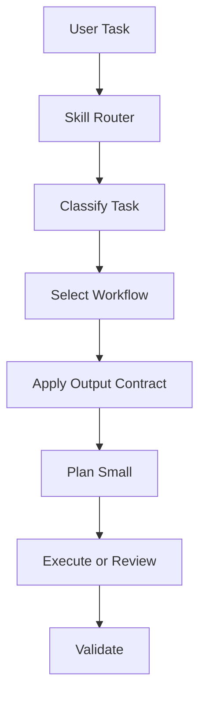

# Universal AI Execution Skill

`universal-ai-execution-skill` is an open-source portable Agent Skill and Workflow Registry v1 for disciplined AI-assisted work.

It helps AI agents classify a task, select the right workflow, inspect the repository first, plan small, avoid overbuilding, and validate before claiming completion. It is guidance and structure for AI execution; human review remains required and correctness is not guaranteed.

## Who Should Use It

- AI coding agents that need consistent task routing.
- Agent platform builders that want portable workflow instructions.
- Maintainers who want small, reviewable AI-assisted changes.
- Developers who want clearer prompts, safer execution, and validation discipline.

## How It Works



The router lives in `skills/universal-ai-execution/SKILL.md`.

Workflow Registry v1 lives in `skills/universal-ai-execution/references/workflow-registry.yaml` and currently defines 46 workflows. The generated readable registry is `skills/universal-ai-execution/references/technique-registry.md`.

Supporting references define task classification, output contracts, validation rules, PR breakdown discipline, security review constraints, documentation integrity, product/business review rules, and anti-patterns.

## Project Structure

- `skills/universal-ai-execution/SKILL.md`: portable skill router.
- `skills/universal-ai-execution/references/workflow-registry.yaml`: source of truth for workflows.
- `skills/universal-ai-execution/references/technique-registry.md`: generated readable registry.
- `skills/universal-ai-execution/references/*.md`: classification, contracts, and guardrail references.
- `adapters/`: usage instructions for Codex, generic LLMs, Cursor, GitHub Copilot, and Symphony-style orchestration.
- `examples/`: practical workflow selection examples with good and bad prompts.
- `tests/`: structure and registry integrity tests.
- `scripts/`: registry generation and structure validation scripts.
- `docs/`: design principles, roadmap, release checklist, and versioning policy.

## Use With Codex

Copy or merge `adapters/codex/AGENTS.md` into a repository `AGENTS.md` file. The adapter directs Codex to read `skills/universal-ai-execution/SKILL.md`, select workflows from Workflow Registry v1, apply output contracts, and validate before claiming completion.

## Use With Generic LLMs

Paste `adapters/generic-llm/universal-invocation-prompt.md` into an LLM session and fill in `[TASK]`, `[REPO_CONTEXT]`, `[CONSTRAINTS]`, and `[EXPECTED_OUTPUT]`.

Generic LLM environments cannot automatically read files or run commands unless the surrounding tool provides that ability, so include the relevant skill files in context.

## Use With Cursor

Place `adapters/cursor/universal-ai-execution.mdc` in a Cursor rules location, such as `.cursor/rules/`, when that environment supports `.mdc` rules.

## Use With GitHub Copilot

Use `adapters/github-copilot/copilot-instructions.md` as repository or chat instruction text where Copilot custom instructions are supported.

## Use With Symphony-Style Orchestration

Use `adapters/symphony/WORKFLOW.md` as issue-driven orchestration guidance. It is not a runtime implementation and does not claim native Symphony compatibility.

## Examples

Examples show realistic workflow selection, expected output structure, and good versus bad prompting behavior.

- [Codebase audit](examples/codebase-audit-example.md)
- [Backend/UI integration audit](examples/backend-ui-integration-example.md)
- [Security audit](examples/security-audit-example.md)
- [MVP planning](examples/mvp-planning-example.md)
- [Refactor plan](examples/refactor-plan-example.md)
- [Documentation cleanup](examples/documentation-cleanup-example.md)
- [RBAC design](examples/rbac-design-example.md)
- [Testing strategy](examples/test-strategy-example.md)
- [GTM strategy](examples/gtm-strategy-example.md)
- [Career positioning](examples/career-positioning-example.md)

## Local Validation

Install lightweight development requirements, then run the structure tests and standalone validation script:

```sh
python -m pip install -r requirements-dev.txt
python -m pytest
python scripts/validate-skill-structure.py
```

Use `python3` instead of `python` if your environment does not provide a `python` command.

Regenerate the readable registry with:

```sh
uv run scripts/generate-technique-registry.py
```

The tests validate package structure, router/registry separation, required reference files, adapter files, and all 46 workflow IDs in both registry outputs.

## Roadmap

See [docs/roadmap.md](docs/roadmap.md).

Release direction:

- `v0.1.0`: skill foundation.
- `v0.2.0`: registry hardening.
- `v0.3.0`: adapters and examples.
- `v0.4.0`: tests and validation.
- `v1.0.0`: stable public release.

## Documentation

- [Design principles](docs/design-principles.md)
- [Roadmap](docs/roadmap.md)
- [Release checklist](docs/release-checklist.md)
- [Versioning policy](docs/versioning.md)
- [Contributing guide](CONTRIBUTING.md)
- [Security policy](SECURITY.md)
- [Changelog](CHANGELOG.md)

## Contribution Summary

Contributions should be issue-driven, small, scoped, and validated. Do not add workflows, adapters, examples, tests, or runtime behavior outside the current issue scope. See [CONTRIBUTING.md](CONTRIBUTING.md).

## License

Licensed under the Apache License, Version 2.0. See [LICENSE](LICENSE).
